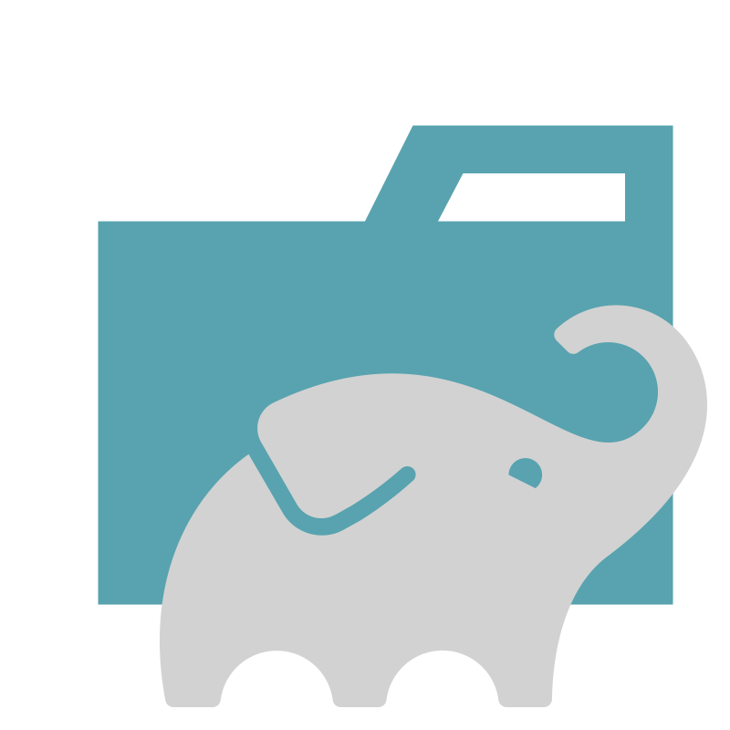

<a href="https://reqres.in/">  
<h2 >Проект по автоматизации API тестов для компании <a href="https://reqres.in/ "> REQRES </a></h2> 

## Содержание:

- Технологии и инструменты
- Список проверок, реализованных в тестах
- Запуск тестов (сборка в Jenkins) и из терминала
- Allure-отчет
- Интеграция с Allure TestOps
- Интеграция с Jira
- Уведомление в Telegram о результатах прогона тестов


<a id="tools"></a>
## Технологии и инструменты:
<p align="center">
  
  
  
  
  
  
  
  
  
  
</p>

<a id="cases"></a>
## Реализованные проверки:
- Получение списка пользователей
- Создание пользователя
- Обновление информации о пользователе
- Замена чаcти информации o пользователе
- Получение ошибки при запросе несуществующего пользователя
- Удаление пользователя

##  Сборка в [Jenkins](https://jenkins.autotests.cloud/job/reqresin_api_autotest/)


<p align="center">  
</a>  
</p>


## Параметры сборки в Jenkins:

При запуске сборки в **Jenkins** можно использовать следующие параметры:

- `TASK` — выбор тестов для запуска, **по умолчанию** `reqresin_test`


## Команда для запуска из терминала
Локальный запуск
```bash
gradle clean reqresin_test
```
Удаленный запуск через Jenkins:
```bash  
clean ${TASK}
```

## </a>  <a name="Allure"></a>Allure [Report](https://jenkins.autotests.cloud/job/reqresin_api_autotest/3/allure/)	</a>


## Основная страница отчёта

<p align="center">  
  
</p>  

____
## </a> Уведомление в Telegram при помощи бота
____
<p align="center">  
  
</p>


